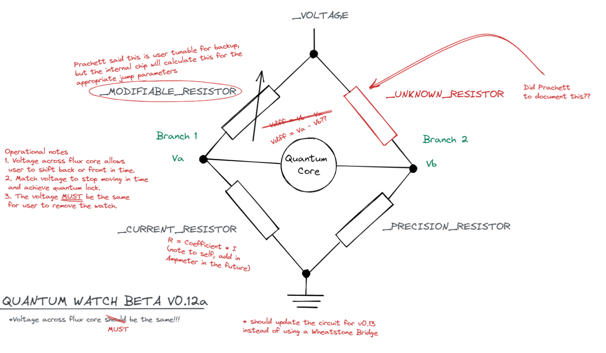

# Quantum Watch
by Halogen
> Problem Description
## Provided Files
[Schematics.png](./assets/schematics.png)
## Solution

Wow its a physics problem, so its time to put our **PHYSICS BRAINS** to the test. We will now define the following variables so that we could plug it into our lord and saviour `sympy` to do the math for us. There is absolutely no reason to do the math by hand (I'm looking at you @ilovemrt2222)

```math
\begin{aligned}
V   &=\ \text{The final voltage (Shown above as \_VOLTAGE)}\\
V_D &=\ \text{Voltage Difference across Quantum Core }(V_a-V_b)\\
I_1 &=\ \text{Current through Branch 1}\\
I_2 &=\ \text{Current through Branch 2}\\
k   &=\ \text{Coefficient of Current Resistor}\\
R_1 &=\ k\times I_1\\
R_2 &=\ \text{Precision Resistor Resistance}\\
R_3 &=\ \text{Modifiable Resistor Resistance}\\
R_4 &=\ \text{Unknown Resistor Resistance}
\end{aligned}
```

Using the well known Ohm's Law ($V=IR$ across a resistor), and the fact that resistors in series have their equivalent voltage as their sum ($R_1 + R_2 = R_{total}$) we get 2 equations for each branch

$V = I_1(R_1 + R_3) = I_1(k\times I_1 + R_3)$
$V = I_2(R_2 + R_4)$
Then we can also get $V_D = V_a - V_b = I_1 R_1 - I_2 R_2 = I_1 (k\times I_1) - I_2 R_2$

We are then given $V, k, R_3$ and just plug them in too

```python
from sympy import symbols, solve, Eq 

# Variables
v, vd, i1, i2, k, r2, r3, r4 = symbols('v,vd,i1,i2,k,r2,r3,r4')

# Known Values
eqs = [ 
   Eq(k, 180.4843), 
   Eq(r2, 197.90182), 
   Eq(v, 99.7743), 
   Eq(vd, 0), 
] 

# Our 3 equations
eqs.append(Eq(i1 * (k * i1 + r3), v)) 
eqs.append(Eq(i2 * (r2 + r4), v)) 
eqs.append(Eq(k * i1 * i1 - r2 * i2, vd)) 

# Printing our solutions
print(solve(eqs, dict = True))
```

Wait a second, this gives me infinite solutions (in terms of $R_4$). We need more information. Luckily, if you tried entering any value for $R_3$ you would notice that they give the corresponding $V_D$ and another attempt! We can plug our values for $R_3$ and $V_D$ in as well, solving for $R_4$

Knowing $R_4$ we now plug that value in (remember to reset $V_D$ to $0$) and get $R_3$ our answer to stabalised the quantum core, saving Jaga!

Flag: `STF22{L0ng_Qu8ntum_3hift}`
