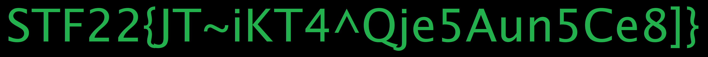

# Numerals
by scuffed and m0n0valu3nce
> Problem Description
> 
> Prof. Foo Lee Ye was working with Jaga on an important investigation, but he decided to take a last minute sabbatical to Nepal.  
> He forgot to share the password of his encrypted drive with Jaga, and he is uncontactable due to the remoteness of Nepalese countryside.
>
> One thing to note, Prof. Foo has a weird passion for encoding his credentials with unique base number systems.
>
> Jaga has found the following few files in a USB drive in Prof Foo's office.
>
> Would you like to help?

## Solution
Apparently there was "info for participants" which stated that the LOG file is required for the challenge's operation and not part of the challenge itself, which we somehow didn't see and spent an unnecessary amount of time looking at.

Moving on, what we're given is a multipart zipfile which provides us with a file `b5b421406a65a16`. Running it, we get the following:

```sh
└─$ ./b5b421406a65a16
pygame 2.1.2 (SDL 2.24.0, Python 3.10.6)
Hello from the pygame community. https://www.pygame.org/contribute.html
WARNING:root:Place the key in the same folder.
Key file: KEY
Traceback (most recent call last):
  File "/tmp/onefile_6085_1670484881_753878/__main__.py", line 27, in <module>
  File "/tmp/onefile_6085_1670484881_753878/json/__init__.py", line 293, in load
  File "/tmp/onefile_6085_1670484881_753878/json/__init__.py", line 346, in loads
  File "/tmp/onefile_6085_1670484881_753878/json/decoder.py", line 340, in decode
json.decoder.JSONDecodeError: Extra data: line 1 column 2 (char 1)
```

Ok, fascinating. We see that `KEY` is a file containing characters ranging from 0 to 9 and A to B. We assume that in this binary, it decodes it from the mysterious base it's in to get us a nice JSON file.

Let's just shoot for the obvious and try Base-12 since we have 0 to 9, A to B.

```py
from Crypto.Util.number import bytes_to_long, long_to_bytes

key = "7B2517805053231..."

def decodeFromKeys(alphabet, s):
    length = len(alphabet)
    out = 0
    for i in s:
        for j in range(length):
            if alphabet[j] == i:
                out = out * length + j 
                break
    return out

val = decodeFromKeys("0123456789AB", key) # val = 818220320724177015417961747908718880463...
```
So we get a really huge number... why don't we just convert from long to bytes?

```py
string = long_to_bytes(val)
print(string) # b'[[-3.95, -0.1], [-0.975, -1.1], [-0.95, -2.075], [-1.9, -1.7], ...
```
Oh. There's the json. That was pretty straight forward. Let's dump it into a different file and pass it into the program.


That. Was. Epic.

Afterwards, `flag.png` appeared in my working directory.



Flag: `STF22{JT~iKT4^Qje5Aun5Ce8]}`
