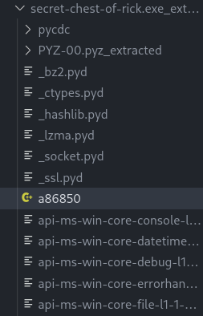

# Secret Chest of Rick
by scuffed and m0n0valu3nce
> Problem Description
> The Secret Chest of Rick contains unfathomable secret that may allow you to turn the tide in times of need. You may, however, incur the wrath of Rick if you fail to decipher the code.
> 
> Help Jaga to uncover secret of the chest.

## Solution
Secret Chest of Rick is a challenge which tests grit. To quote Wikipedia,
> In psychology, grit is a positive, non-cognitive trait based on an individual's perseverance of effort combined with the passion for a particular long-term goal or end state.

The challenge doesn't involve any particularly exciting exploits or trickery, just raw pain.

We are first presented with an exe file, `secret_chest_of_rick.exe`. Running it in wine, we get the following:
```
You have come across a secret chest.
At the same time, you hear a voice from far distance...
"Opening this chest will grant you great power."
"HOWEVER, you may bear great consequences if you fail."
"Should you choose to proceed, I leave it up to you. HA-HA-HA-HAAA..."
On a closer look, you found that this chest requires 2 sets of passcode to be opened.
You decided to look around for more clues.

Please enter the 1st 16-alphanumeric passcode: 1234567812345678
Incorrect passcode! Exiting...
```
Interesting. Opening it in ghidra, we notice some strings alluding to PyInstaller


We thus run [PyInstaller Extractor](https://github.com/extremecoders-re/pyinstxtractor) to get the `pyc` files and subsequently run them through [uncompyle6](https://pypi.org/project/uncompyle6/) in order to obtain some readable `py` files.

We are now left with a python script which we can work with.

## Passcode One

The first important part of the script is the following:
```py
try:
    D = len(v) * len(v)
    x = lambda f, n: f(f, n)
    y = lambda f, n: chr(n % D) + f(f, n // D) if n else ''
    r = m(x(y, int(v)).encode()).hexdigest()
    if 'deb2742ec3cb41518e26aa2d89' not in r:
        raise Exception
except:
    print('Incorrect passcode! Exiting...')
    exit(1)
```

To even progress with the challenge, we first have to get an md5 hash which contains the partial hash as provided. Oof.

A few hours after first starting on this challenge, I noticed a suspicious file that was included in the decompilation result named `a86850`. 



Another line of code alludes to this being the first few characters of the intended md5 hash:

```py
p = path.abspath(path.join(path.dirname(__file__), r[0:6])) # r is the result of the md5 hash from above
os.chdir(os.path.dirname(APPPATH))
```
Thus, we had the hash `a86850deb2742ec3cb41518e26aa2d89`. Throwing it into CrackStation...


Yikes. Googling the hash, however, gives some interesting results.


Could `qwerty` be it? 

```sh
❯ echo "qwerty" | md5sum
a86850deb2742ec3cb41518e26aa2d89  -
```

Damn! However, in python, this doesn't seem to be the case.

```
>>> from hashlib import md5
>>> md5("qwerty".encode()).hexdigest()
'd8578edf8458ce06fbc5bb76a58c5ca4'
```

Turns out, you have to take the newline into consideration that `echo` apparently appended.

```
>>> md5("qwerty\n".encode()).hexdigest()
'a86850deb2742ec3cb41518e26aa2d89'
```

Nice! Now, we just need a simple script that reverses the process in this chunk of code. We simply need a 16 digit number `v` which when divided repeatedly by `D = len(v) * len(v) = 256` gives us the characters `qwerty\n`.

```py
arr = list(b"qwerty\n")
D = 256
out = 0
for i in range(7, -1, -1):
    out = out * 256 + arr[i]
    print(out, long_to_bytes(out))
```

This outputs the passcode `2948290809526129`.

```
You have come across a secret chest.
At the same time, you hear a voice from far distance...
"Opening this chest will grant you great power."
"HOWEVER, you may bear great consequences if you fail."
"Should you choose to proceed, I leave it up to you. HA-HA-HA-HAAA..."
On a closer look, you found that this chest requires 2 sets of passcode to be opened.
You decided to look around for more clues.

Please enter the 1st 16-alphanumeric passcode: 2948290809526129
Please enter the 2nd 20-alphanumeric passcode: AAAAAAAAAAAAAAAAAAAA
So close yet so far...
Yml0LmRvL1llZXRZZWV0
```
Nice! Onto the second passcode.

## Passcode Two
To whoever the challenge creator is, I hope you find the `bit.do/YeetYeet` rickroll very funny, because I certainly did, and laughed a lot. I really LOL'd at it. Hahaha.

Anyways, here is the relevant chunk of code:
```py
try:
    with open(p, 'r') as (f):
        d = dc(f.read(), str(v))
        b = b(d)
        h = ML(b)
        f = c(MG(h, r[0:6]), C(ccp, ccp))
        v = input('Please enter the 2nd 20-alphanumeric passcode: ')
        if not re.match(R2, v):
            print('Invalid input! Exiting...')
            exit(1)
        r = f(v.encode())
        if not r or m(r).hexdigest() != H:
            print('So close yet so far...')
            print('Yml0LmRvL1llZXRZZWV0')
            exit(1)
        MF(h)
    n.close()
    d = dc(V, v)
    if re.match(R3, d):
        print('Congratulation, you have passed the challenge!')
    else:
        d = 'STF22{%s}' % a
    print("Here's your flag: " + d)
```

Here, we have something really interesting going on. The lines 
```py
h = ML(b)
f = c(MG(h, r[0:6]), C(ccp, ccp))
```
are of particular significance. Tracing back the imports we see that `h = ML(b)` is a call to `MemoryLoadLibrary` while `c(MG(h, r[0:6]), C(ccp, ccp))` is a call to `MemoryGetProcAddress`, searching with the string `a86850` that we're now familiar with, and essentially allowing us to access that function from within python.

Dumping `b` into a file, we find that it is a `DLL` file:
```sh
❯ file bee
bee: PE32 executable (DLL) (GUI) Intel 80386, for MS Windows
```
Nice, let's just throw _this_ into ghidra and see what the `a86850` function is.


Yuck. Let's step through the code.

```c
*(undefined *)_Src = 0;
*_Src = *param_1;

*(undefined *)(_Src + 1) = *(undefined *)(param_1 + 1);
*(undefined *)((int)_Src + 5) = 0;

*(undefined *)_Src_00 = 0;
*_Src_00 = *(undefined4 *)((int)param_1 + 5);


*(undefined *)(_Src_00 + 1) = *(undefined *)((int)param_1 + 9);
*(undefined *)((int)_Src_00 + 5) = 0;


*(undefined *)puVar2 = 0;
*puVar2 = *(undefined4 *)((int)param_1 + 10);


*(undefined *)(puVar2 + 1) = *(undefined *)((int)param_1 + 14);
*(undefined *)((int)puVar2 + 5) = 0;

*(undefined *)puVar3 = 0;
*puVar3 = *(undefined4 *)((int)param_1 + 15);


*(undefined *)(puVar3 + 1) = *(undefined *)((int)param_1 + 19);
*(undefined *)((int)puVar3 + 5) = 0;
```

What we see here is the input string `param_1` being split into sets of 5 characters.

```
FUN_100010a0(local_6c,100,"%s",(char) puVar2 );
strcat_s(_Dst,100,local_6c);


FUN_100010a0(local_6c,100,"%s",(char) _Src + '\x02');


strcat_s(_Dst,100,local_6c);
strncpy_s(local_6c,100,(char *)_Src_00,2);
strcat_s(_Dst,100,local_6c);

FUN_100010a0(local_6c,100,"%s",(char)puVar3 + '\x01');
strcat_s(_Dst,100,local_6c);


FUN_100010a0(local_6c,100,"%c",*(undefined *)puVar3);
strcat_s(_Dst,100,local_6c);

strncpy_s(local_6c,100,(char *)_Src,2);

uVar5 = SUB41(_Src,0);
strcat_s(_Dst,100,local_6c);
strncpy_s(local_6c,100,(char *)((int)_Src_00 + 2),2);
strcat_s(_Dst,100,local_6c);
```
By the function arguments, we can tell that `FUN_100010a0` is likely `sprintf`. It seems to be rearranging the characters of the input string, chopping it up and pasting it in different parts.

But what is the intended output string anyways?

Looking back at the python code, we notice this check:
```py
if not r or m(r).hexdigest() != H:
    print('So close yet so far...')
    print('Yml0LmRvL1llZXRZZWV0')
    exit(1)
```
where `H = '4304dfa8ce893becb10252ec78fcf5c2'`. Throwing _this_ into CrackStation...


Hahaha. Very funny guys. Something to note here, however, is that the string `NEVERGONNAGIVEYOUUP` is 19 characters long, whereas the input is 20 characters long.

Reversing the code painstakingly, we have that the input string looks like `OUGONNAUP_NEVERYGIVE`, where some character goes into that blank. Let's just put some random character there and see what happens.

```
You have come across a secret chest.
At the same time, you hear a voice from far distance...
"Opening this chest will grant you great power."
"HOWEVER, you may bear great consequences if you fail."
"Should you choose to proceed, I leave it up to you. HA-HA-HA-HAAA..."
On a closer look, you found that this chest requires 2 sets of passcode to be opened.
You decided to look around for more clues.

Please enter the 1st 16-alphanumeric passcode: 2948290809526129
Please enter the 2nd 20-alphanumeric passcode: OUGONNAUPPNEVERYGIVE
Here's your flag: STF22{dQw4w9WgXcQ}
```
Wait. Hang on a second. That doesn't look right. That looks like the YouTube content ID for the Rick Roll.

Looking at the python file again, we note the following:
```py
d = dc(V, v)
if re.match(R3, d):
    print('Congratulation, you have passed the challenge!')
else:
    d = 'STF22{%s}' % a
print("Here's your flag: " + d)
```
So we need our input `v` to match some `V` such that `d` matches some `R3`. However, we just need the regex of the input `v` to follow `R2 = '^[0-9a-zA-Z]{20}$'`. This means that just the characters in `abcdefghijklmnopqrstuvwxyzABCDEFGHIJKLMNOPQRSTUVWXYZ0123456789` could possibly go in that blank, so why don't we just bruteforce it?

```py
from pwn import *

input1 = b"2948290809526129"
input2_half1 = b"OUGONNAUP"
input2_half2 = b"NEVERYGIVE"

valid = b"abcdefghijklmnopqrstuvwxyzABCDEFGHIJKLMNOPQRSTUVWXYZ0123456789"

for v in valid:
    io = process(["wine", "secret-chest-of-rick.exe"])
    io.sendlineafter(b"16-alphanumeric passcode:", input1)
    input2 = bytearray()
    input2 += input2_half1
    input2.append(v)
    input2 += input2_half2
    input2 = bytes(input2)
    io.recvline()
    print(f"INPUTTING: {input2}")
    io.sendlineafter(b"ric passcode:", input2)
    if b"Congratulation" in io.recvline():
        print(io.recvline())
        break
```

Letting it run...

```
❯ python rick.py
[+] Starting local process '/sbin/wine': pid 84997
INPUTTING: b'OUGONNAUPaNEVERYGIVE'
[+] Starting local process '/sbin/wine': pid 85111
INPUTTING: b'OUGONNAUPbNEVERYGIVE'
[+] Starting local process '/sbin/wine': pid 85117
INPUTTING: b'OUGONNAUPcNEVERYGIVE'
[+] Starting local process '/sbin/wine': pid 85123
INPUTTING: b'OUGONNAUPdNEVERYGIVE'
...
INPUTTING: b'OUGONNAUPANEVERYGIVE'
b"\x1b[?25h\x1b[?25lHere's your flag: STF22{s4y-g00d-by3}\r\n"
```
Yipee!!!!


Flag: `STF22{s4y-g00d-by3}`
